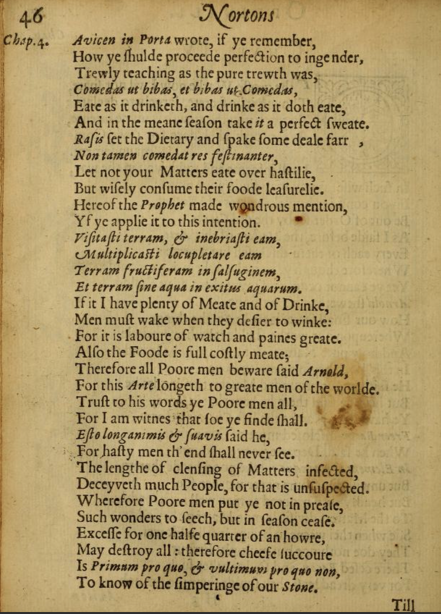

# Alchemical Text from *Theatrum Chemicum Britannicum* (1652)

## Source Text
This task focuses on a short alchemical excerpt taken from *Theatrum Chemicum Britannicum*, edited by Elias Ashmole, published in 1652.

You can view the original scanned text here:  
[Theatrum Chemicum Britannicum, Page 45](https://archive.org/details/theatrumchemicum00ashm/page/46/mode/1up)

## Original Text (Excerpt)

**Paragraph 1**

Avicen in Porta wrote, if ye remember,  
How ye ſhulde proceede perfection to ingender,  
Trewly teaching as the pure trewth was.  
Comedas ut bibas, et bibas ut Comedas,  
Eate as it drinketh, and drinke as it doth eate,  
And in the meane ſeaſon take it a perfect ſweate.  
Raſis set the Dietary and ſpake ſome deale farr,  
Nontamen comedatres feſtinanter,  
Let not your Matters eate over haftilie,  
But wiſely conſume their foode leaſurelie.  
Hereof the Prophet made wondrous mention,  
Yf ye applie it to this intention.  

**Paragraph 2**

Viſitaſti terram, & inebriaſti eam,  
Multiplicasti locupletare eam,  
Terram fructiferam in ſalſuginem,  
Et terram ſine aqua in exitus aquarum.  
If it I have plenty of Meate and of Drinke,  
Men muſt wake when they deſire to winke:  
For it is laboure of watch and paines great.  
Alſo the Foode is full coſtly meate;  
Therefore all Poore men beware ſaid Arnold,  
For this Arte longeth to greate men of the worlde.  
Truſt to his words ye Poor men all,  
For I am witnes that ſoe ye finde ſhall.  
Eſto longanimis & ſuavis ſaid he,  
For haſty men th’ end ſhall never ſee.  
The lengthe of clenſing of Matters infected,  
Deceyveth much People, for that is unſuſpected.  
Wherefore Poore men put ye not in preaſe,  
Such wonders to ſeech, but in ſeaſon ceaſe;  
Exceſſ for one halfe quarter of an howre,  
May deſtroy all : therefore cheeſe ſuccoure  
Is primum pro quo, & vultimum pro quo non,  
To know of the ſimperinge of our Stone.

## English Translation

*Note: The translations provided here were done manually, by a human.*

**Paragraph 1**

Avicen in Porta wrote, if you remember,  
How you should proceed to bring about perfection,  
Truly teaching as the pure truth was.  
Eat as you drink, and drink as you eat,  
And in the proper season take a perfect sweat.  
Raſis set the dietary and spoke some distance,  
Nevertheless, eat not hastily,  
Let not your matters proceed too hastily,  
But wisely consume their food leisurely.  
Hereof the Prophet made wondrous mention,  
If you apply it with this intention.

**Paragraph 2**

You have visited the earth and made it drunk,  
You have multiplied it, enriched it,  
A fruitful land turned into a salty one,  
And land without water into the source of waters.  
If I have plenty of meat and drink,  
Men must stay awake when they desire to sleep:  
For it is laborious watching and great pains.  
Also, the food is very costly meat;  
Therefore all poor men beware, said Arnold,  
For this art belongs to the great men of the world.  
Trust his words, all you poor men,  
For I am witness that so you shall find.  
“Be patient and gentle,” said he,  
For hasty men shall never see the end.  
The length of cleansing of infected matters  
Deceives many people, for that is unsuspected.  
Wherefore poor men, do not rush  
To seek such wonders, but cease in season;  
Excess for even one quarter of an hour  
May destroy all: therefore choose help wisely.  
The first cause and the last cause,  
To know the tempering of our Stone.

## XML Annotation

The accompanying XML file (`/tei-examples/sample-annotation.xml`) encodes the original text using TEI-XML markup, tagging key structural elements such as paragraphs and foreign language phrases for analysis.
