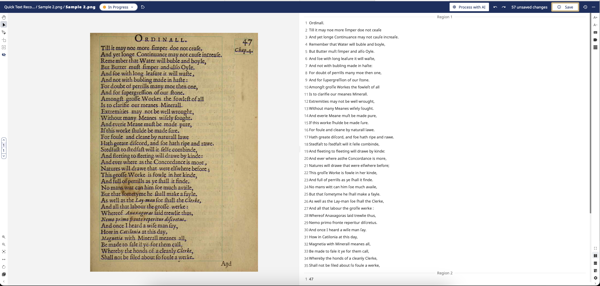

# README for Transkribus Transcription — Page 47

## Source  
This TEI-XML file is a transcription of page 47 from the digitized book *Theatrum Chemicum Britannicum* by Elias Ashmole (1652). The scanned page was obtained from the Internet Archive:  
https://archive.org/details/theatrumchemicum00ashm/page/47/mode/1up

## Transcription Process  
1. **Image Upload:** The page image (`sample-2.png`) was uploaded to the Transkribus platform for handwritten text recognition (HTR).  
2. **HTR Model Used:** The default printed text model "German Giant I" was applied to generate an initial automated transcription.  
3. **Manual Correction:** The automated transcription was carefully reviewed and corrected manually within Transkribus to fix recognition errors and improve accuracy.  
4. **Export:** The corrected transcription was exported as a TEI-XML file from Transkribus and added to this repository.

## Screenshots  
  
*Figure 1: Uploaded manuscript page in Transkribus interface.*

  
*Figure 2: Example of manual correction of the automated transcription in Transkribus.*

## File Details  
- Filename: `transkribus-export.xml`  
- Format: TEI-XML  
- Purpose: Demonstrates the use of machine-assisted transcription tools and the correction workflow for producing accurate digital texts.

## Relation to Manual Annotation  
This file complements the manual annotation work performed on page 46 (`manual-annotation.xml`), illustrating two approaches to transcribing historical texts: manual markup and machine-assisted transcription correction.
